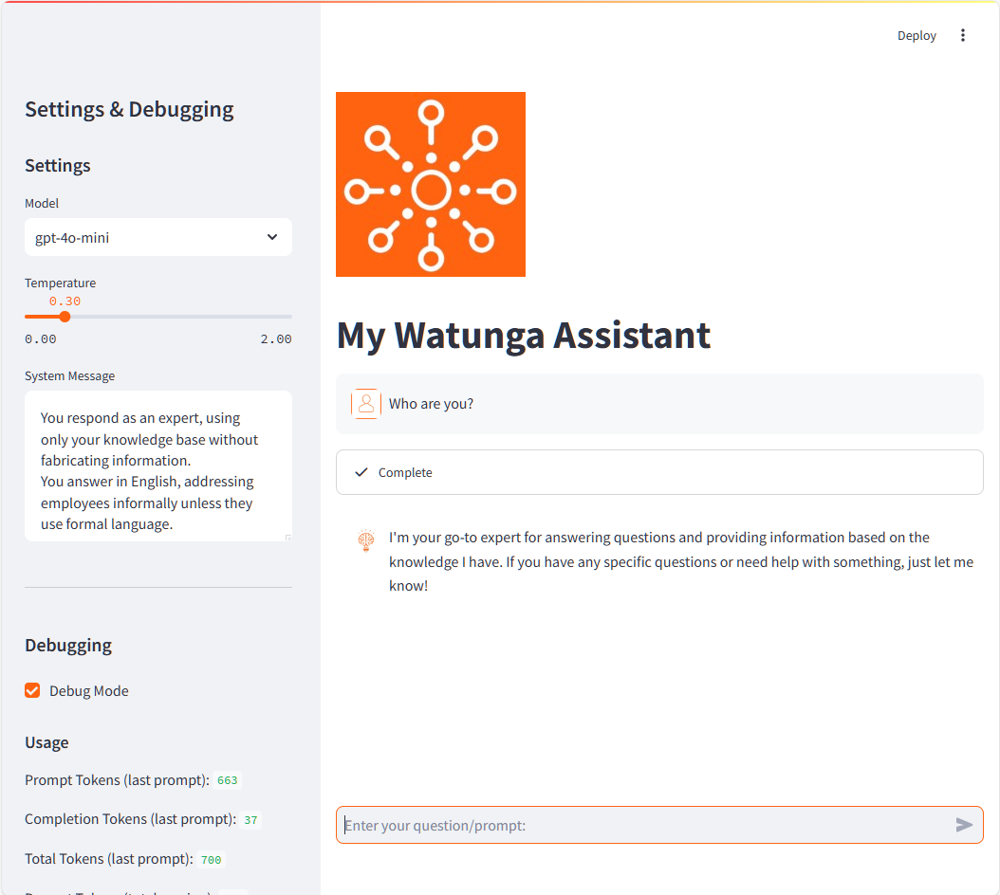

# My Watunga Assistant - Python Chat Application

This is a simple Python-based chat application using Streamlit and OpenAI's Assistants API. The code is structured to create a user-friendly chat interface that interacts with an AI assistant. This README provides a detailed explanation of each section to help you understand how the code works.

If you need help with assistants for your business, check out our website [www.watunga.ai](https://www.watunga.ai)

## Table of Contents
- [My Watunga Assistant - Python Chat Application](#my-watunga-assistant---python-chat-application)
  - [Table of Contents](#table-of-contents)
  - [Overview](#overview)
  - [Environment Setup](#environment-setup)
  - [Code Explanation](#code-explanation)
    - [Imports](#imports)
    - [Loading Environment Variables](#loading-environment-variables)
    - [Instructions for the Assistant](#instructions-for-the-assistant)
    - [Initializing Session State](#initializing-session-state)
    - [User Interface Setup](#user-interface-setup)
    - [Sidebar for Settings and Debugging](#sidebar-for-settings-and-debugging)
    - [Helper Function for Cost Calculation](#helper-function-for-cost-calculation)
    - [Displaying Chat History](#displaying-chat-history)
    - [Handling User Input](#handling-user-input)
  - [Running the Application](#running-the-application)
  - [My Assistant](#my-assistant)
  - [Need Help?](#need-help)


## Overview

The application uses Streamlit to create a web-based chat interface, and it connects with OpenAI's API to process user input and generate responses. All configuration settings are stored in a .env file for easy access and modification.

## Environment Setup

Before running the code, make sure you have the necessary dependencies installed. You will also need to set up a .env file to store your configuration variables securely. Here's how:

1. Install the required packages:

    ```
    pip install streamlit openai python-dotenv
    ```

    or just use the requirements.txt

    ```
    pip install -r requirements.txt
    ```

2. Create a `.env` file in the project directory with the following content:

    ```
    OPENAI_API_KEY=your_api_key_here
    VECTORSTORE_ID=vs_1mZ0szKcmKEYz[...]
    DEFAULT_MODEL=gpt-4o-mini
    DEFAULT_TEMPERATURE=0.3
    TITLE=My Watunga Assistant
    BASE_PATH=C:/users/myuser/PythonCodes/Assistant API
    LOGO=assets/logo.png
    AVATAR_ASSISTANT=assets/avatar_assistant.png
    AVATAR_USER=assets/avatar_user.png
    ```

    or just copy the `.env.bkp` to `.env` and edit the variables.

3. Edit the `model.json` file in the project directory to delivery the AI models, the user can select:

    ```json
    {
        "gpt-4o-mini": {
            "input": {
                "price": 5,
                "tokens": 10000000
            },
            "output": {
                "price": 15,
                "tokens": 10000000
            }
        }, 
        "gpt-4o": {
            "input": {
                "price": 5,
                "tokens": 10000000
            },
            "output": {
                "price": 15,
                "tokens": 10000000
            }
        }, 
        "gpt-4-turbo": {
            "input": {
                "price": 10,
                "tokens": 10000000
            },
            "output": {
                "price": 30,
                "tokens": 10000000
            }
        }     
    }
    ```

## Code Explanation

### Imports

```python
import json
import streamlit as st
import time
from openai import OpenAI
from dotenv import load_dotenv
import os
```

* `json`: Used to load configuration files in JSON format.
* `streamlit`: A library for creating interactive web applications in Python.
* `time`: Used for controlling the flow and adding pauses when waiting for API responses.
* `OpenAI`: The OpenAI library for connecting with their API.
* `dotenv`: Used to load environment variables from a .env file.
* `os`: A built-in module for interacting with the operating system, used here for accessing environment variables.

### Loading Environment Variables

```python
load_dotenv()
```

This function loads environment variables from the `.env` file, making them accessible within the application. This is a secure way to manage sensitive data like API keys.

```python
openai_key = os.getenv("OPENAI_API_KEY")
base_path = os.getenv("BASE_PATH")
default_temperature = float(os.getenv("DEFAULT_TEMPERATURE"))
title = os.getenv("TITLE")
logo = os.getenv("LOGO")
default_model = os.getenv("DEFAULT_MODEL")
avatar__assistant = os.getenv("AVATAR_ASSISTANT")
avatar_user = os.getenv("AVATAR_USER")
vectorstore_id = os.getenv("VECTORSTORE_ID")
```

Each of these lines retrieves a specific value from the environment and stores it in a variable. This keeps the code modular and configurable.

### Instructions for the Assistant

You can modify the `instructions.md`. Here the instructions for the assistant are defined e.g. to give the assistant a specific role or todo. 

### Initializing Session State

```python
if "loaded" not in st.session_state:
    st.session_state["client"] = OpenAI(api_key=openai_key)
    ...
```

* `st.session_state`: A dictionary-like object in Streamlit to store variables across user interactions (e.g., session data).
* The code initializes the OpenAI client using the API key from the environment. It also sets up the AI assistant and stores additional information like models and user settings for later use.

```python
with open(f"{base_path}/models.json", "r") as file:
    st.session_state["models"] = json.load(file)
```

* This reads the models.json file, which contains information about the models available, including token prices, and loads it into the session state.

### User Interface Setup

```python
st.set_page_config(page_title=title)
if logo:
    st.logo(f"{base_path}/{logo}", width=200)
st.title(title)
```

* `st.set_page_config`: Sets the title of the web page.
* `st.logo`: Displays an image (logo) from the specified path.
* `st.title`: Sets the title of the application.

```python
query = st.chat_input("Enter your question/prompt:")
```

* `st.chat_input`: Adds a text input box for user queries. The user can type their questions here.

### Sidebar for Settings and Debugging

```python
st.sidebar.title("Settings & Debugging")
st.sidebar.header("Settings")
```

* `st.sidebar`: Adds a sidebar for user interaction with different configuration options.
* Users can select a model, set the temperature, and modify the system message used to guide the AI's behavior.

### Helper Function for Cost Calculation

```python
def calculate_costs(tokens_prompt: int, tokens_completion: int, model: str) -> float:
    model_info = st.session_state["models"][model]
    price_prompt = model_info["input"]["price"] / model_info["input"]["tokens"]
    price_completion = model_info["output"]["price"] / model_info["output"]["tokens"]
    return (tokens_prompt * price_prompt + tokens_completion * price_completion)
```

* This function calculates the cost of using the OpenAI API based on token usage.
* `tokens_prompt` and `tokens_completion` represent the number of tokens used for the input and output, respectively.
* The function retrieves the pricing information from the model data loaded earlier and computes the total cost.

### Displaying Chat History

```python
for m in st.session_state["messages"]:
    avatar = None
    ...
    with st.chat_message(name=m["role"], avatar=avatar):
        st.write(m["content"])
```

* This section displays the chat history, showing both user and AI messages.
* `st.chat_message`: A Streamlit component that shows each message with the appropriate role (user or assistant) and avatar.

### Handling User Input

```python
if query:
    with st.chat_message(name="user", avatar=f"{base_path}/{avatar_user}"):
        st.write(query)
    
    status = st.status("Fetching response...", expanded=False)
    ...
```

* This section handles new user input. It shows the user’s message in the chat and updates the status while the AI processes the response.

* The following code retrieves and displays the assistant’s response:

```python
    if assistant_run_retrieved.status == "completed":
        result = st.session_state["client"].beta.threads.messages.list(
            thread_id=st.session_state["assistant_thread"].id
        )
        answer = result.data[0].content[0].text.value

        with st.chat_message(name="assistant", avatar=f"{base_path}/{avatar_assistant}"):
            st.write(answer)
```

* `st.chat_message`: Displays the AI’s response in the chat window.

* The code also appends the messages and updates the session state with token usage and costs.

## Running the Application

To run the application:
```bash
streamlit run assistant.py
```

Open your browser to the URL provided in the terminal, and you will see the chat interface ready for use.

## My Assistant

Here is a screenshot of the assistant:



## Need Help?

If you need help with assistants for your business, check out our website [www.watunga.ai](https://www.watunga.ai)
